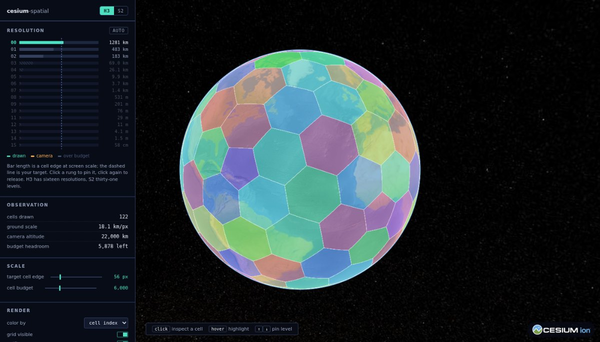
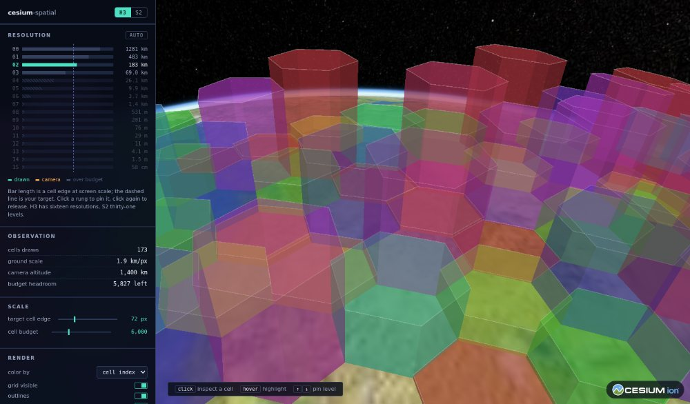

# cesium-spatial

[](https://www.npmjs.com/package/@stevenpg/cesium-h3)
[](https://www.npmjs.com/package/@stevenpg/cesium-s2)
[](LICENSE)
[](https://cesium.com/platform/cesiumjs/)
[](https://github.com/StevenPG/cesium-spatial/actions/workflows/ci.yml)
[](https://github.com/StevenPG/cesium-spatial/actions/workflows/e2e.yml)

H3 and S2 grid cells on a CesiumJS globe, without having to learn H3 or S2 first.

Cover whatever the camera is looking at, draw thousands of cells as a single batched primitive, and
walk neighbors, parents and children in Cesium's own vocabulary — longitude before latitude,
degrees in, Cesium types out.



**[Live demo](https://stevenpg.github.io/cesium-spatial/demo.html)** ·
**[API reference](https://stevenpg.github.io/cesium-spatial/api/)**

## Install

```bash
npm install @stevenpg/cesium-h3 cesium
```

```ts
import { Viewer } from 'cesium';
import { H3ViewLayer } from '@stevenpg/cesium-h3';

const viewer = new Viewer('cesiumContainer');

// Watches the camera, picks a resolution, respects a cell budget.
new H3ViewLayer(viewer.scene, { maxCells: 8000, outlines: true });
```

That is the whole feature in one object. Everything underneath it is a plain function you can call
directly when you want the pieces rather than the package deal.

## Why this exists

Putting a discrete global grid on a Cesium globe is deceptively fiddly, and most of the difficulty
is not in H3 or S2 themselves.

Cesium has no zoom levels, so deciding which resolution to draw means measuring ground
meters-per-pixel from the frustum rather than reading a number off the camera. Drawing thousands of
cells means batching them into one primitive, which in turn means recoloring has to write into
per-instance attributes instead of rebuilding geometry, and picking has to map a geometry instance
back to something your application recognizes. A zoomed-out view has no natural bound at all, so
something has to estimate the cost of a cover before generating it rather than after.

Then there are the places where the grids stop behaving uniformly. H3 reads any polygon whose
longitudes jump more than 180° as crossing the antimeridian, with no way to say otherwise, so asking
for the 200° around Greenwich quietly returns the 160° around the dateline instead — a plausible
cell count made of entirely the wrong cells. H3 also has twelve pentagons where the fast neighbor
routines return nothing. S2 has no pentagons and handles wrapping extents natively, but its coverer
treats a minimum level as non-negotiable and will hand back millions of cells rather than truncate,
and its two polar cube faces enclose a pole rather than touching it.

Each of those is a day lost to something that is not the problem you sat down to solve. This library
is the accumulated answer to them.

## Packages

| Package | Description |
| --- | --- |
| [`@stevenpg/cesium-h3`](packages/h3) | The H3 hexagonal grid |
| [`@stevenpg/cesium-s2`](packages/s2) | The S2 quadrilateral grid |
| [`@stevenpg/cesium-spatial-core`](packages/core) | Shared rendering, picking, camera and level-of-detail |

Install whichever grid you need; core arrives as its dependency. Reach for core directly only if you
are adapting a different index onto the same machinery.

The two grid packages share that core but deliberately keep their own vocabulary. H3 speaks of
resolutions, disks and rings; S2 of levels, tokens and cube faces. Each reads naturally to someone
who already knows that index, at the cost of a small shim if you want to switch between them at
runtime — [the demo's is about thirty lines](apps/demo/src/systems.ts).

## What you get

Beyond the view-driven layer, both packages cover the same ground in their own idiom: traversal
across neighbors, parents, children and compaction; cell boundaries as Cesium positions,
cartographics or rectangles; covers from a rectangle, a polygon or the current camera; and layers
that render either as one batched primitive or as individual entities.

`H3CellLayer` and `S2CellLayer` are the default: thousands of cells become a single `Primitive`, and
`setCellStyle` recolors or hides one of them without touching geometry. The entity layers cost far
more per cell and give each one a real Cesium `Entity` in exchange, with either an options bag or a
full construction hook. Both support terrain clamping, extrusion into prisms, and optional outlines.

`CellPicker` resolves a click or hover on a batched primitive back to a cell id, which is the part
most people hand-roll incorrectly.



## Examples

[`examples/`](examples) holds short programs for the things people actually
reach for: a camera-driven grid, click-to-cell with a resolution slider,
aggregating points into per-cell counts, cells as 3D bars, covering a rectangle
or polygon, picking and traversal, entities, and the S2 equivalents. They are
typechecked against the published declarations as part of `pnpm verify`, and
bundled against the built package in CI, so they cannot quietly rot.

## Cesium compatibility

Cesium is a peer dependency, so these packages never bundle a second copy of the engine. The
declared range is `cesium >= 1.95`, and the code sticks to APIs that have been stable far longer
than that. `@cesium/engine` is supported as an optional peer; everything used lives in engine, so an
engine-only project can alias `cesium` to it in the bundler.

The floor is verified rather than assumed: `cesium-matrix.yml` typechecks and tests the packages
against 1.95, 1.110, 1.120, 1.144 and the current release, weekly and on every change to
`packages/`.

TypeScript is floored at 5.0, the first release that understands `moduleResolution: Bundler`. That
is checked the same way rather than claimed: CI installs the published tarballs into a fresh project
and typechecks the declarations and every example under 5.0, 5.4, 5.8 and the current release. A
library that ships its own types is only as compatible as the oldest compiler that can read them,
and nothing in a normal build would notice a declaration that needs a newer one.

## Development

```bash
pnpm install
pnpm verify           # format check, lint, typecheck, tests, package builds
pnpm dev              # demo at http://localhost:5173/cesium-spatial/
pnpm build:site       # the whole Pages site into docs-dist/
pnpm test:e2e         # drive the demo in a real browser
pnpm check:pack       # inspect what would actually publish
pnpm check:consumer   # pack, npm install, typecheck, run and bundle the examples
pnpm check:published  # install the released packages from npm and verify them
```

Unit tests cover the geometry, cover and level-of-detail logic, none of which needs a WebGL context.
Everything that needs a camera or a pick is covered by the browser tests in `e2e/` instead.
[CONTRIBUTING.md](CONTRIBUTING.md) has the rest.

## Continuous integration

| Workflow | What it does |
| --- | --- |
| `ci.yml` | Format, lint, build, typecheck and unit tests; package correctness; a full consumer install; the declarations against four TypeScript versions; and the released packages pulled from npm |
| `e2e.yml` | Ten Playwright tests driving the built demo in a real browser |
| `cesium-matrix.yml` | The packages against five CesiumJS versions, weekly and whenever they change |
| `version.yml` | Keeps a version pull request open as changesets accumulate |
| `release.yml` | Publishes to npm when a `v*` tag is pushed |
| `pages.yml` | Builds and deploys this site |

`ci.yml` and `e2e.yml` run on every pull request and every push to `main`; `cesium-matrix.yml` on
pull requests that touch `packages/`, and weekly besides. `version.yml` and `release.yml` are the
two halves of [Releasing](#releasing), and `pages.yml` redeploys the site whenever `main` moves.

### What actually gets tested against the built package

Worth being precise, because it is easy to build a pipeline that never touches
what ships. The demo's bundler is aliased straight at `packages/*/src`, and the
examples are typechecked against the generated declarations — neither resolves
the built entry point at runtime.

`scripts/check-consumer.mjs` is the step that does. It packs the real tarballs,
installs them into a throwaway project with plain npm, and then typechecks the
published declarations, executes the ESM output under Node, bundles every
example in `examples/` against the built package with esbuild, and asserts that
importing one function still bundles smaller than importing everything. A broken
`exports` map or a file missing from `files` passes every other check in the
repository and fails only here.

`scripts/check-pack.mjs` sits alongside it and refuses to let a tarball publish
a `workspace:` range, which npm cannot install and nothing else notices.

`scripts/check-published.mjs` closes the last gap, which is the difference
between a build that came out wrong and a release that went out wrong. It
installs the three packages from the public registry with nothing local
involved, confirms each tarball contains what its manifest claims, that every
`exports` target and source map reference resolves inside the published package,
that the registry signatures and provenance attestations verify, and that the
result typechecks, runs and bundles. Before the first release the registry
returns a 404 and the script skips, so the job is green on a repository that has
never published and starts doing real work the moment one exists. It also runs
after a publish, against the release that just happened.

The program it compiles there is deliberately frozen to API from the first
release. Growing it to cover a newer export would make the job fail against the
version that is actually live, which is the opposite of the point.

Dependabot watches npm and the actions themselves, grouping the toolchain into
one pull request a week. CesiumJS is deliberately excluded: the peer range is a
compatibility promise rather than something to bump automatically, and the
weekly matrix run covers new releases instead.

## Releasing

Versioning runs on [Changesets](https://github.com/changesets/changesets), with all three packages
moving in lockstep. Publishing is separate from it and is triggered by a tag, so deciding a version
and deciding to ship it are two different moments.

A change that affects a published package carries a changeset describing it:

```bash
pnpm changeset
```

Once those land on `main`, `version.yml` keeps a `chore: version packages` pull request open holding
the resulting version bumps and changelog entries. Merging it sets the version. Nothing is published
at that point, and the branch can sit there as long as it needs to.

Shipping is a tag:

```bash
pnpm release:tag       # reads the version, tags it, pushes it
```

or by hand, if you would rather see it:

```bash
git tag v0.2.0 && git push origin v0.2.0
```

`release.yml` picks up any `v*` tag, checks out the tag itself, and refuses to go further unless the
tag matches the versions in the tree, no changeset is still unapplied, and none of the three
versions already exists on the registry. Only then does it run the full verification, the package
and consumer checks, publish through pnpm with provenance, and open a GitHub release carrying that
version's changelog entries. `pnpm check:release v0.2.0` runs the same gate locally.

Three details are load-bearing. The version guard exists because npm publishes one package at a time
and refuses to overwrite, so a mismatch discovered mid-publish leaves a release half done with no
clean way back. The publish goes through pnpm rather than npm because pnpm rewrites the
`workspace:^` range on core into real semver as it packs, while npm ships the literal string and
produces a tarball that installs nowhere — `pnpm check:pack` guards that separately. And the tag is
checked out directly rather than the branch it sits on, so what gets published is what was tagged.

Publishing needs an `NPM_TOKEN` secret with rights to the `@stevenpg` scope; provenance signs
through GitHub's OIDC and needs no secret of its own.

## License

Apache-2.0. See [LICENSE](LICENSE).

Built on [CesiumJS](https://cesium.com/platform/cesiumjs/), [H3](https://h3geo.org/) and
[S2](http://s2geometry.io/).
